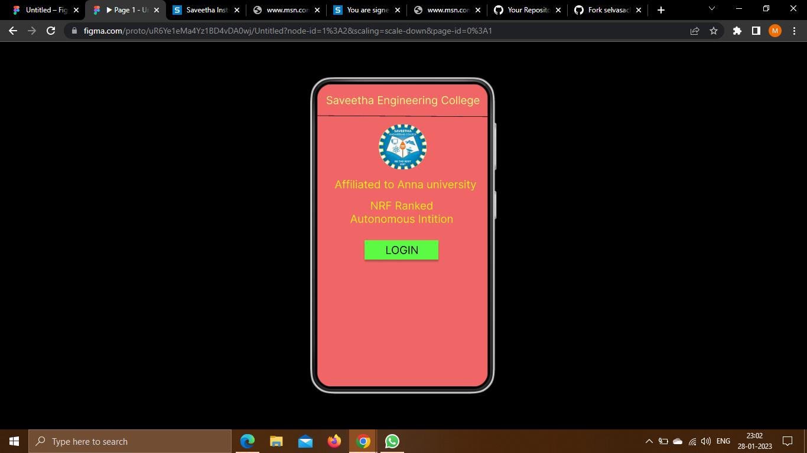
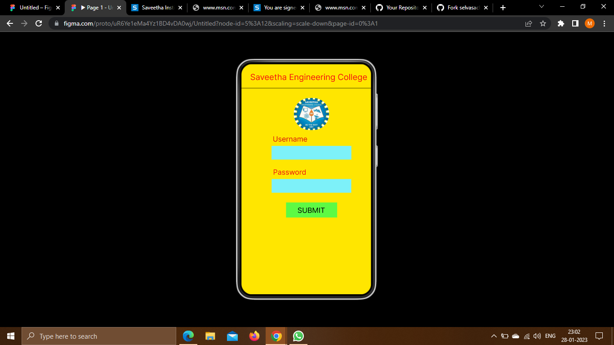
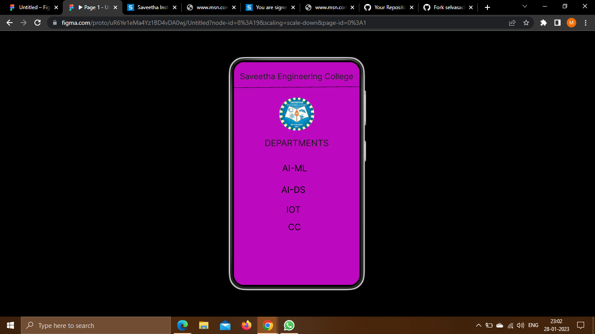

# Event Registration Web Application

## AIM:
To design, develop and deploy a web application for event registration.

## DESIGN STEPS:

### Step 1:
Create a new frame.

### Step 2:
Select any one preset size of your choice.

### Step 3:
Select the shapes you need.

### Step 4:
Import images as needed.

### Step 5:
Create pages based on your need and link them.

### Step 6:

Validate the HTML and CSS code.

### Step 6:

Publish the website in the given URL.

## DESIGN TOOL:
Figma

## code:
```
/* Home Page */
position: relative;
width: 360px;
height: 640px;
background: #F06565;

/* Login page */
position: relative;
width: 360px;
height: 640px;
background: #FFE600;

/* Saveetha Engineering College */
position: absolute;
width: 333px;
height: 43px;
left: 13px;
top: 13px;
font-family: 'Inter';
font-style: normal;
font-weight: 400;
font-size: 23px;
line-height: 28px;
display: flex;
align-items: flex-end;
text-align: center;
color: #1E1E1E;

/* Line 3 */
position: absolute;
width: 360.01px;
height: 0px;
left: 0px;
top: 75px;
border: 1px solid #000000;
transform: rotate(-0.48deg);


/* download 4 */
position: absolute;
width: 100px;
height: 94px;
left: 130px;
top: 103px;
background: url(download.jpg);
border-radius: 97px;

/* DEPARTMENTS */
position: absolute;
width: 230px;
height: 51px;
left: 65px;
top: 197px;
font-family: 'Inter';
font-style: normal;
font-weight: 400;
font-size: 25px;
line-height: 30px;
display: flex;
align-items: flex-end;
text-align: center;
color: #1C1919;

/* AI-ML */
position: absolute;
width: 138px;
height: 25px;
left: 105px;
top: 295px;
font-family: 'Inter';
font-style: normal;
font-weight: 400;
font-size: 25px;
line-height: 30px;
display: flex;
align-items: flex-end;
text-align: center;
color: #000000;

/* AI-DS */
position: absolute;
width: 81px;
height: 34px;
left: 130px;
top: 348px;
font-family: 'Inter';
font-style: normal;
font-weight: 400;
font-size: 25px;
line-height: 30px;
display: flex;
align-items: flex-end;
text-align: center;
color: #000000;

/* IOT */
position: absolute;
width: 81px;
height: 29px;
left: 130px;
top: 410px;
font-family: 'Inter';
font-style: normal;
font-weight: 400;
font-size: 25px;
line-height: 30px;
display: flex;
align-items: flex-end;
text-align: center;
color: #000000;

/* CC */
position: absolute;
width: 105px;
height: 34px;
left: 121px;
top: 455px;
font-family: 'Inter';
font-style: normal;
font-weight: 400;
font-size: 25px;
line-height: 30px;
display: flex;
align-items: flex-end;
text-align: center;
color: #000000;
```
## OUTPUT:




## RESULT:
The program to design, develop and deploy a web application for event registration is completed successfully.